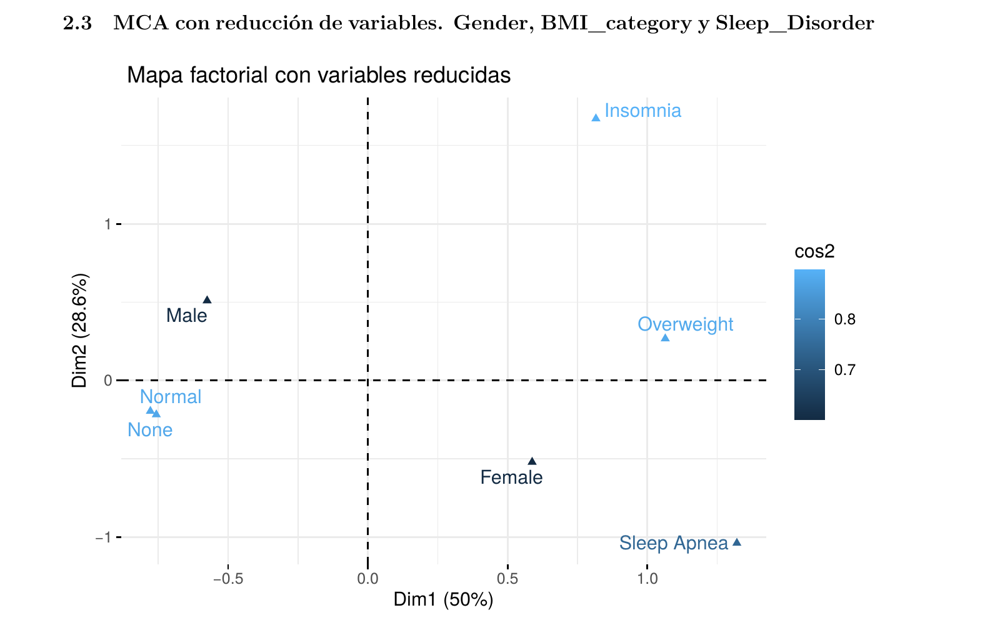
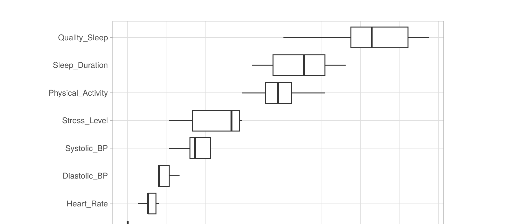
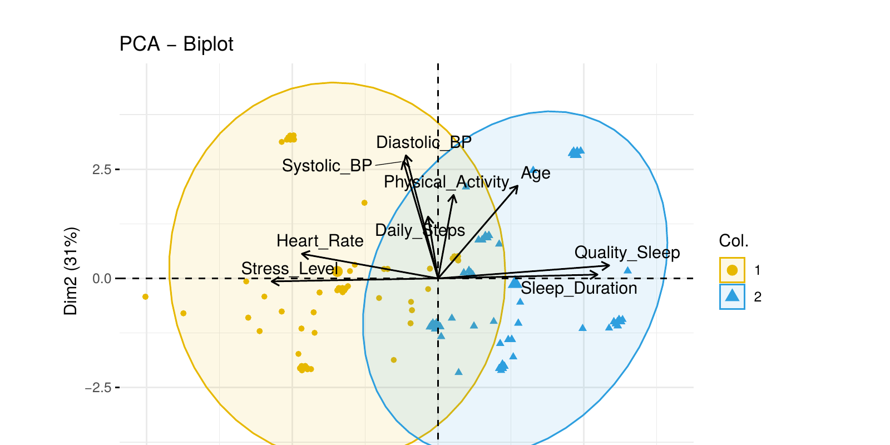

# Análisis de salud y calidad del sueño: comparación de métodos de clasificación y clustering

Análisis aplicado sobre un dataset clínico de 374 pacientes, combinando estadística inferencial clásica con técnicas de machine learning, para identificar qué factores se asocian a la presencia de trastornos del sueño (insomnio, apnea) y evaluar distintos enfoques de clasificación y segmentación.

## Contexto

El dataset (*Sleep Health and Lifestyle*, Kaggle) registra hábitos diarios, indicadores clínicos (presión arterial, frecuencia cardíaca, IMC) y presencia de trastornos del sueño en 374 personas. El objetivo fue doble: **explorar qué variables se asocian a cada trastorno** y **comparar distintos métodos de clasificación supervisada y no supervisada** para predecir o caracterizar esos trastornos.

Como bioquímica con formación en ciencia de datos, abordé el problema priorizando la validez estadística de cada paso: chequeo de supuestos antes de aplicar cada técnica, justificación de por qué se descarta o se elige un método, e interpretación clínica de los resultados — no solo su performance numérica.

## Qué se hizo

**1. Reducción de dimensionalidad (MCA)**
Análisis de correspondencias múltiples sobre variables categóricas (género, ocupación, IMC, trastorno de sueño), con un proceso iterativo de reagrupación de categorías de baja frecuencia para mejorar la interpretabilidad. El modelo final con variables reducidas explica el 79% de la inercia total en dos dimensiones.



*Los hombres con IMC normal se agrupan con ausencia de trastornos; las mujeres con sobrepeso se asocian a insomnio y apnea del sueño.*

**2. Validación estadística formal**
Las asociaciones exploradas en el MCA se contrastaron con pruebas de independencia Chi-cuadrado (IMC × trastorno, género × trastorno) y MANOVA para evaluar diferencias multivariadas entre grupos, incluyendo el chequeo de los supuestos correspondientes (normalidad multivariada con test de Mardia, homogeneidad de covarianzas con test de Box).

**3. Clasificación supervisada: comparación de tres enfoques**
- **QDA robusto** (estimación MCD), elegido por sobre LDA/QDA clásico al no cumplirse los supuestos de normalidad y homocedasticidad. Validado con 5-fold cross-validation (Accuracy ≈ 0.79).
- **Regresión logística multinomial**, con chequeo previo de multicolinealidad (VIF) y exclusión de predictores redundantes.
- **Random Forest**, evaluando la importancia relativa de cada variable mediante el aumento en tasa de error al permutarla.



*La calidad y duración del sueño son, por amplio margen, los predictores más relevantes para clasificar el tipo de trastorno.*

**4. Clustering y validación no supervisada**
Comparación de métodos de clustering (`clValid`) y segmentación con PAM, contrastada contra la clasificación clínica real (validación externa). El biplot de PCA permite visualizar cómo se separan los clusters según las variables originales.



*El Cluster 1 se asocia a mayor estrés y frecuencia cardíaca; el Cluster 2, a mejor calidad y duración del sueño.*

## Herramientas

R · tidyverse · FactoMineR / factoextra (MCA, PCA) · caret (validación cruzada) · rrcov (QDA robusto) · nnet (regresión multinomial) · randomForest · cluster / clValid (PAM) · car (VIF) · biotools / MVTests (supuestos multivariados)

## Estructura del repositorio

```
├── analisis.Rmd                      # Código completo, comentado por sección
├── Sleep_AnalisisInteligente.rds     # Dataset utilizado
├── images/                           # Visualizaciones principales
└── README.md
```

## Nota

Este es un trabajo académico (Maestría en Minería de Datos, UTN) adaptado como muestra de portfolio. El reporte completo en PDF, con anexos estadísticos detallados, está disponible a pedido.
